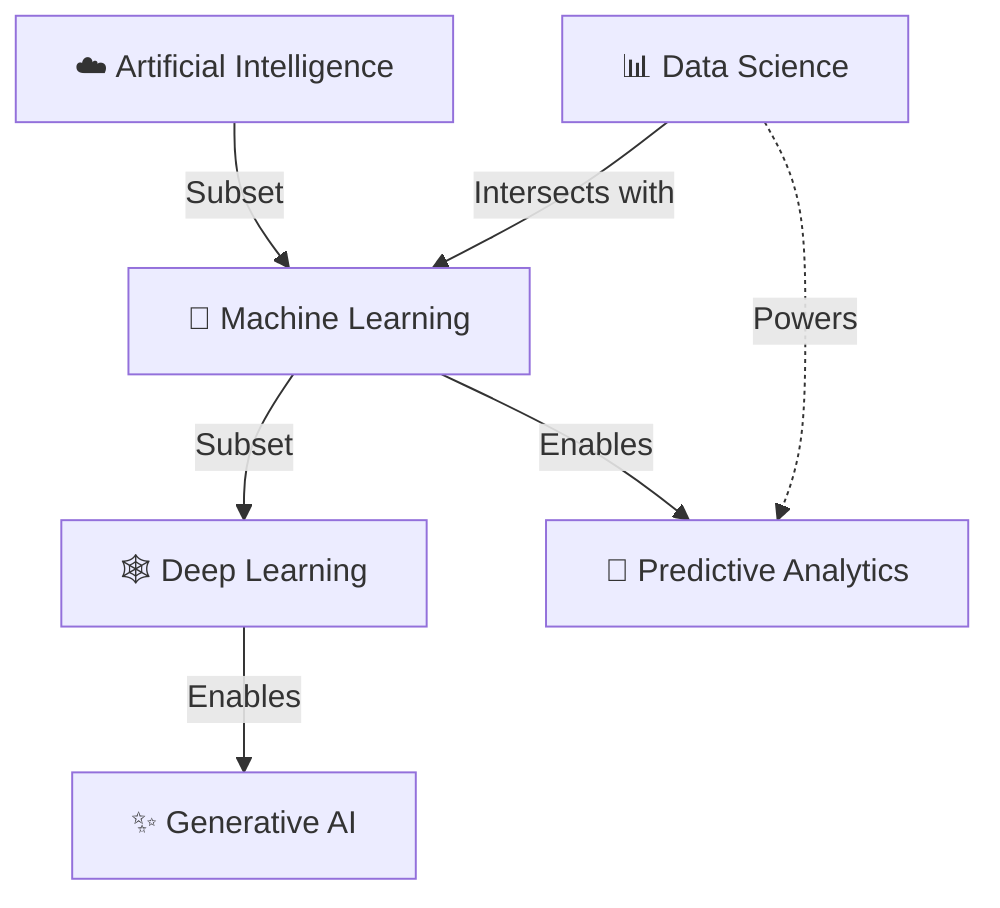
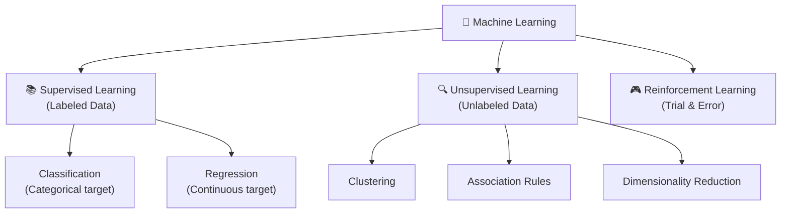
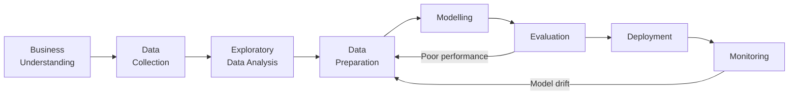

# 📋 Session Overview
- **Week:** 2
- **Day:** Thursday
- **Theme:** Introduction to Data Science & Machine Learning
- **Summary:** This session began with a hands-on review of the Tuesday assignment — Pandas filtering and column creation — before transitioning into a comprehensive introduction to Data Science and Machine Learning. It covered the AI/ML/DS ecosystem, types of analytics, types of data, the ML paradigm shift from rule-based systems, and an in-depth survey of all three ML learning paradigms: Supervised, Unsupervised, and Reinforcement Learning.

---

# 🎯 Learning Objectives
- Differentiate between AI, Machine Learning, Deep Learning, Data Science, and Predictive Analytics.
- Classify data as Structured, Unstructured, or Semi-Structured.
- Contrast traditional rule-based models with machine learning models.
- Identify and explain the three main types of Machine Learning and their sub-types.
- Understand the end-to-end Machine Learning Workflow from problem framing to deployment.
- Know the core Python/DS/ML tool ecosystem.
- Apply Pandas filtering (`&`, `|`, `.isin()`, `.query()`) and column creation techniques.

---

# 📖 Key Concepts & The AI Ecosystem

To effectively work with data, it is crucial to understand the distinctions and intersections between various buzzwords in the industry. They often nest within one another:



### ☁️ Artificial Intelligence (AI)
The broadest overarching concept. AI refers to any technique that enables computers to mimic human intelligence, logic, or behavior — from simple `if-else` rule-based expert systems to complex neural networks.

### 🧠 Machine Learning (ML)
A direct subset of AI. Instead of being explicitly programmed with hardcoded rules, ML systems use statistical methods to **learn patterns directly from data** to improve performance on a specific task.

### 🕸️ Deep Learning (DL)
A specialized subset of ML that utilizes multi-layered (deep) **Artificial Neural Networks** inspired by the human brain. DL requires massive amounts of data and computational power (GPUs) and excels at unstructured data tasks: Image Recognition, Natural Language Processing (NLP), and Generative AI.

### 📊 Data Science (DS)
A multidisciplinary field that extracts actionable insights from both structured and unstructured data. It sits at the intersection of:
1. **Mathematics & Statistics:** Probability distributions, hypothesis testing.
2. **Computer Science:** Python, SQL, data structures, algorithms.
3. **Domain Expertise:** Applying business context to raw numbers.

> 💡 **Definition** (session): "Data Science is the art of extracting actionable insights from large, complex datasets using statistics, programming, and domain expertise."

### 🔮 Predictive Analytics (PA)
Predictive Analytics sits at the **intersection of ML and Data Science**. It specifically focuses on using mathematical models and historical data to forecast future probabilities and trends (e.g., predicting customer churn or stock prices).

---

# 📝 Detailed Notes

## 1. Types of Analytics

Analytics generally falls into three progressive stages — each more sophisticated than the last:

| Type | Question | Method | Example |
|------|----------|--------|---------|
| **Descriptive** | What happened? | BI dashboards, reports | Monthly sales reports |
| **Predictive** | What will happen? | Statistical models, ML | Predicting customer churn |
| **Prescriptive** | What should we do? | Optimization, simulation | Route optimization for logistics |

> 💡 **Going Deeper:** There is a fourth type increasingly discussed: **Diagnostic Analytics** ("Why did it happen?") — which uses drill-down and correlations to identify root causes. In practice, a full data science workflow often spans all four.

---

## 2. Types of Data

Understanding data types is essential before choosing the right tools and models.

```
┌─────────────────────────────────────────────────────────────────┐
│                        DATA TYPES                               │
├───────────────────┬───────────────────┬─────────────────────────┤
│   STRUCTURED      │   SEMI-STRUCTURED │   UNSTRUCTURED          │
├───────────────────┼───────────────────┼─────────────────────────┤
│ • Spreadsheets    │ • JSON            │ • Text & social media   │
│ • SQL databases   │ • XML             │ • Images & videos       │
│ • CSV files       │ • HTML            │ • Audio recordings      │
│ • Financial data  │ • Server logs     │ • Email bodies          │
│ • Sensor readings │ • Email metadata  │ • Web pages             │
├───────────────────┼───────────────────┼─────────────────────────┤
│ Age: 25, Churn: Y │ Has some struct.  │ "I love this product!"  │
│ Fits rows/columns │ but not tabular   │ No fixed format         │
└───────────────────┴───────────────────┴─────────────────────────┘
```

> 📌 **Did You Know?** About **80% of enterprise data is unstructured** — text, images, audio. Traditional analytics tools (SQL, Excel) can't handle it. This is why Deep Learning and NLP are so valuable: they unlock insights from what was previously inaccessible data.

---

## 3. Rule-Based Systems vs. Machine Learning

Traditionally, developers wrote **hardcoded rules** to dictate how data should be processed into an output.

```
RULE-BASED SYSTEM:
  Data → Human Analysis → Explicit Rules → Output

MACHINE LEARNING:
  Data + Expected Output → ML Algorithm → Learns the Rules → Output
```

| Dimension | Rule-Based System | Machine Learning |
|-----------|------------------|------------------|
| **Rule creation** | Humans craft rules manually | Machine discovers patterns automatically |
| **Simple problems** | Works well | Overkill |
| **Complex problems** | Breaks down quickly | Excels |
| **Scalability** | Limited by human capacity | Scales with data volume |
| **Consistency** | Varies by the person who wrote rules | Objective, no fatigue |
| **Bias** | Human bias embedded in rules | Algorithm bias (different problem) |
| **Maintenance** | Expensive — rules must be updated manually | Model retraining handles drift |

> 💡 **Pro Tip:** Rule-based systems are still valuable in **strict regulatory environments** where 100% interpretability is required (e.g., some medical or legal domains). ML models, especially neural networks, are "black boxes" — a major challenge in regulated industries. The field of **Explainable AI (XAI)** actively works on this.

> 📌 **Session Quote (Kumar):** "More importantly, the consistency and objectivity — human bias comes into picture the moment you have rule-based systems, not with machine learning."

---

## 4. The Three Pillars of Machine Learning

Machine Learning algorithms are categorized based on **how they learn**:



---

### 4.1 Supervised Learning

Learning from **labeled data** where the target variable (the answer) is known in advance. The algorithm learns the mapping from inputs (independent variables / features) to the known output (dependent variable / target).

**Two sub-types:**

#### Classification — Categorical Target
The target variable takes discrete categories.
- Is this email **spam or not spam**? (binary)
- What is the movie's genre? (multi-class)
- Will this customer **churn** in the next month?

#### Regression — Continuous Target
The target variable is a continuous numeric value — it can be any number.
- What is the **price** of this house?
- What will the **temperature** be tomorrow?
- What is the **customer lifetime value**?

**Supervised ML: Classification vs Regression**

| | Classification | Regression |
|---|---|---|
| **Target type** | Categorical (discrete) | Continuous (any number) |
| **Output** | A class label | A number |
| **Example** | Spam / Not Spam | House Price |
| **Algorithms** | Logistic Regression, Decision Trees, SVM, KNN | Linear Regression, Random Forest, XGBoost |
| **Metric** | Accuracy, Precision, Recall, F1 | MAE, RMSE, R² |

> 💡 **Pro Tip:** The name "Logistic Regression" is misleading — despite "Regression" in the name, it is a **classification** algorithm. It predicts a probability between 0 and 1, then applies a threshold to classify. It's one of the most commonly misunderstood naming conventions in ML.

---

### 4.2 Unsupervised Learning

Learning from **unlabeled data**. The algorithm finds hidden patterns, groupings, and structures without predefined answers.

**Three sub-types:**

#### Clustering
Organizes similar data points into groups. No labels — the algorithm figures out what "similar" means from the data itself.
- **Example:** Grouping Netflix users who watch similar movies → recommend unwatched films from the cluster.
- **Algorithms:** K-Means, DBSCAN, Hierarchical Clustering.

#### Association Rules
Finds relationships and co-occurrence patterns among features.
- **Example:** "Users who watched War Film A and B also watched War Film C" → recommend Film C to users who've only seen A and B.
- **Example:** "Customers who buy bread also buy butter" → supermarket shelf placement.
- **Algorithms:** Apriori, FP-Growth.

#### Dimensionality Reduction
Reduces the number of features while retaining critical information. Useful when you have hundreds of columns.
- **Example:** Compressing 100 financial features into 5 key components without losing predictive power.
- **Algorithms:** PCA, t-SNE, UMAP.

> 📌 **Session Example (Kumar):** Netflix recommendations — two people watched 2 out of 3 war films. Since their viewing history is similar (clustered together), the third war film gets recommended to the person who hasn't watched it. This is unsupervised — there is no "correct label" for what movies belong together, the algorithm discovers the clusters.

---

### 4.3 Reinforcement Learning

Learning through **trial and error** through interactions with an environment. The algorithm:
1. Takes an **Action** in an **Environment**
2. Receives a **Reward** (positive) or **Penalty** (negative)
3. Adjusts its policy to **maximize cumulative reward** over time

```
Agent → Action → Environment → Reward/Penalty → Agent (learns) → ...
```

- **Example:** A robot learning to walk — falls down (penalty), adjusts movements, eventually learns to walk.
- **Example:** AlphaGo learning to beat human Go champions — millions of trial games.
- **Example:** Self-driving car training — penalties for collisions, rewards for efficient routes.

**Comparison of All Three Types:**

| | Supervised | Unsupervised | Reinforcement |
|---|---|---|---|
| **Data** | Labeled | Unlabeled | No dataset — environment feedback |
| **Output** | Prediction | Clusters / Patterns | Policy / Actions |
| **When to use** | Known target variable | Hidden patterns | Sequential decision-making |
| **Examples** | Spam filter, price prediction | Customer segmentation, recommendations | Robotics, game AI, auto-trading |
| **Key challenge** | Labeling data is expensive | Interpreting clusters is subjective | Designing a good reward function |

---

## 5. Key ML Algorithms — Big Picture

*(These will be covered in depth in upcoming sessions)*

| Algorithm | Type | Use Case |
|-----------|------|----------|
| **Linear Regression** | Supervised | Predict continuous values (price, score) |
| **Logistic Regression** | Supervised | Binary classification (yes/no outcomes) |
| **Decision Trees** | Supervised | Rules-based classification & regression |
| **Random Forest** | Supervised | Ensemble of trees — high accuracy |
| **SVM** | Supervised | Find optimal decision boundary |
| **K-Nearest Neighbors** | Supervised | Classify by similarity/proximity |
| **Neural Networks** | Supervised + DL | Complex patterns (images, NLP) |
| **K-Means** | Unsupervised | Group similar data points |

---

## 6. The Machine Learning Workflow

Building a model is an **iterative**, not linear, process:



### Step-by-Step Breakdown

1. **Business Understanding** — Frame the right question. What is the goal? How will predictions be used? What does "success" look like? A wrong question here propagates through every subsequent step.

2. **Data Collection** — Gather relevant data from structured (SQL, CSV), unstructured (text, images), or semi-structured sources (APIs, JSON).

3. **Exploratory Data Analysis (EDA)** — Visualize data, find correlations, spot anomalies. "Know your data before modeling it."

4. **Data Preparation** — The most time-consuming step (~60–80% of total effort). Includes:
   - **Data Cleaning:** Handling missing values, correcting typos, removing duplicates, treating outliers.
   - **Data Transformation:** Scaling, encoding categorical variables.
   - **Data Restructuring:** Combining from multiple sources (joins, merges).
   - **Feature Engineering:** Creating new columns from existing ones (e.g., `age_group` from `age`).
   - **Data Division:** Splitting into train and test sets for reliable evaluation.

5. **Modelling** — Training the ML algorithm to recognize patterns in the training data.

6. **Evaluation** — Measuring how well the model performs on unseen test data using metrics like Accuracy, Precision, Recall, MAE, RMSE.

7. **Deployment** — Integrating the trained model into production systems so it can make real-world predictions.

8. **Monitoring** — Continuously tracking model performance as real-world data evolves.

> 💡 **Going Deeper: Model Drift**
> In production, ML models don't exist in a vacuum. Consumer behavior changes, new trends emerge, and sensor calibrations drift. A model trained in 2019 might fail in 2020 due to the pandemic dramatically changing purchasing habits. This is why **monitoring** and retraining loops are critical components of **MLOps** (Machine Learning Operations). Practically, you should set up automated alerts when model accuracy drops below a threshold.

---

## 7. Benefits of Machine Learning

- **Adaptability & Speed:** Quickly analyzes large amounts of data that would take humans years.
- **Scalability:** Efficiency improves as datasets grow — the opposite of rule-based systems.
- **Consistency & Objectivity:** No fatigue, no subjective bias (though training data can carry historical bias).

---

# 💻 Technical Deep-Dive / Code & Tools

## 7.1 Assignment Review — Pandas Filtering & Column Creation

The session began by reviewing the Tuesday assignment using the `pandas_fundamentals_2.ipynb` notebook. The core patterns:

### Pandas Filtering

```python
import pandas as pd

names = ['K', 'J', 'I', 'D', 'E']
ages = [25, 30, 35, 28, 22]
salaries = [50000, 60000, 75000, 55000, 45000]
departments = ['IT', 'HR', 'IT', 'Finance', 'IT']

df = pd.DataFrame({
    "name": names,
    "age": ages,
    "salary": salaries,
    "department": departments
})
```

#### Single condition filter
```python
# Step 1: Build the boolean mask
age_filter = df['age'] > 25
# 0    False
# 1     True
# 2     True
# 3     True
# 4    False
# Name: age, dtype: bool

# Step 2: Apply the mask
df[age_filter]
```

#### `.isin()` — cleaner than chaining OR conditions
```python
# Instead of: df[(df['department'] == 'IT') | (df['department'] == 'HR')]
dept_filter = df['department'].isin(['IT', 'HR'])
df[dept_filter]
```

#### Combining conditions with `&` (AND) and `|` (OR)
```python
# ⚠️ CRITICAL: Use & | ~ (not Python's and/or/not)
# ⚠️ ALWAYS wrap each condition in parentheses

filter_combined = (df['age'] > 25) & (df['salary'] > 60000)
df[filter_combined]
#   name  age  salary department
# 2    I   35   75000         IT
```

> ⚠️ **Common Pitfall:** Using Python's `and`/`or` instead of `&`/`|` raises a `ValueError: The truth value of a Series is ambiguous`. You must use the bitwise operators `&`, `|`, `~`. And always wrap each condition in parentheses — operator precedence will surprise you without them.

#### `.query()` — SQL-like filtering (clean and readable)
```python
# String-based query — great for complex filters, readable
filter_df = df.query('age > 25 and salary > 60000')

# Works with OR too
filter_df = df.query("department == 'IT' or department == 'HR'")
```

> 💡 **Pro Tip:** `.query()` is excellent for readability but has limitations: column names with spaces must be backtick-quoted (`` `my column` ``), and you can't easily reference external Python variables without the `@var_name` syntax.

---

### Creating New Columns

#### Simple vectorized operation
```python
# Multiply every salary by 0.5 — no loop needed (vectorized)
df['base_salary'] = df['salary'] * 0.50
```

#### String methods via `.str` accessor
```python
df['name_upper'] = df['name'].str.upper()
```

#### Conditional column with `apply()` + lambda
```python
# Binary condition (works, but prefer np.where for performance)
df['age_group'] = df['age'].apply(lambda x: 'young' if x < 30 else 'senior')
```

#### Named function with `apply()`
```python
def age_category(num):
    if num < 30:
        return 'young'
    return 'senior'

df['age_group'] = df['age'].apply(age_category)
```

#### Multi-column logic with `apply(axis=1)`
```python
def segment_staff(row):
    if row['age'] <= 30 and row['department'] == 'IT':
        return 'IT Junior'
    return 'senior'

df['staff_seg'] = df.apply(segment_staff, axis=1)
```

> ⚠️ **Performance Warning:** `df.apply(func, axis=1)` iterates row-by-row in Python — it is **slow on large datasets**. For production code, prefer:
> - `np.where(condition, true_val, false_val)` for binary conditions
> - `np.select([cond1, cond2], [val1, val2], default=val_default)` for multiple conditions
> - Vectorized pandas operations (`df['col'] * 2`) wherever possible

#### Dropping and Renaming
```python
# Drop a column (returns new DataFrame — original unchanged without inplace=True)
df_dropped = df.drop('base_salary', axis=1)

# Drop a row by index
df_dropped = df.drop(0, axis=0)

# Rename a column
df_renamed = df.rename(columns={'base_salary': 'base_component'})
```

---

## 7.2 NumPy Fundamentals Review

The `numpy_fundamentals.ipynb` notebook covered core array operations from Tuesday:

```python
import numpy as np

# 1D array
array_1d = np.array([1, 2, 3, 4, 5])
print(array_1d.shape)   # (5,)

# 2D array
array_2d = np.array([[1, 2], [3, 4], [5, 6]])
print(array_2d.shape)   # (3, 2) — 3 rows, 2 columns

# Special arrays
np.zeros(5)               # array([0., 0., 0., 0., 0.])
np.zeros((3, 4), dtype=int)  # 3x4 array of integer zeros
np.ones(5)                # array([1., 1., 1., 1., 1.])
np.ones((5, 4))           # 5x4 array of ones

# Random values
np.random.rand(5)         # 5 random floats in [0, 1)
np.random.rand(3, 3)      # 3x3 matrix of random floats
```

> 💡 **Pro Tip:** For reproducible ML experiments, always seed your random number generator. Prefer the modern API:
> ```python
> rng = np.random.default_rng(seed=42)
> rng.random(5)   # Reproducible random values
> ```

---

## 7.3 The Python Data Science Ecosystem

| Layer | Tool | Purpose |
|-------|------|---------|
| **Language** | Python | The primary language for DS/ML |
| **Language** | R | Statistical computing alternative |
| **Arrays** | NumPy | Numerical arrays, foundation of the stack |
| **DataFrames** | Pandas | Tabular data manipulation |
| **Visualization** | Matplotlib | Static charts and plots |
| **Visualization** | Seaborn | Statistical visualizations built on Matplotlib |
| **Classical ML** | scikit-learn | Algorithms, pipelines, metrics |
| **Deep Learning** | TensorFlow | Production-grade deep learning (Google) |
| **Deep Learning** | PyTorch | Research-first deep learning (Meta) |
| **Notebooks** | Jupyter | Interactive code + markdown environment |
| **Platforms** | Google Colab | Free GPU-backed Jupyter in the cloud |
| **Platforms** | Kaggle | Competitions + free GPU notebooks |
| **Platforms** | Hugging Face | Pre-trained models (NLP, vision, audio) |
| **Platforms** | AWS SageMaker | Enterprise ML platform |

> 📌 **Did You Know?** NumPy is the **foundation** of the entire Python DS/ML stack. Pandas DataFrames, scikit-learn estimators, TensorFlow tensors, and PyTorch tensors all ultimately build on NumPy's `ndarray`. If NumPy didn't exist, you'd have to rebuild all of them.

---

## 7.4 Conceptual Code — What ML Looks Like in Practice

Here is a minimal end-to-end supervised ML example using `scikit-learn` to preview what's coming in upcoming sessions:

```python
from sklearn.linear_model import LinearRegression
from sklearn.model_selection import train_test_split
from sklearn.metrics import mean_absolute_error
import numpy as np

# Simulated house data: [sq_ft, bedrooms]
X = np.array([[800, 1], [1200, 2], [1500, 3], [2000, 4], [2500, 4]])
y = np.array([150000, 220000, 280000, 350000, 420000])   # prices

# Step 1: Split into train and test sets (80/20)
X_train, X_test, y_train, y_test = train_test_split(X, y, test_size=0.2, random_state=42)

# Step 2: Train the model (it "learns" the rules from data)
model = LinearRegression()
model.fit(X_train, y_train)

# Step 3: Predict on unseen test data
predictions = model.predict(X_test)

# Step 4: Evaluate
mae = mean_absolute_error(y_test, predictions)
print(f"Mean Absolute Error: ${mae:,.0f}")

# The model learned: price ≈ f(sq_ft, bedrooms) — no human rules written!
```

> 💡 **Pro Tip:** `train_test_split` is critical. **Never evaluate your model on the same data it was trained on** — that's like testing a student with the exact exam questions they memorized. The model would appear perfect but fail on new data. This is called **overfitting**.

---

# ❓ Q&A / Discussion Highlights

**Q: When do you use rule-based systems vs ML?**
A: Rule-based when you need full interpretability and the problem is simple (strict regulatory environments, small decision trees manageable by humans). ML when the problem space is large, complex, or would require thousands of manually written rules. Many production systems use both — ML for pattern detection, rules for guardrails and compliance checks.

**Q: Will we implement all these algorithms?**
A (Rajkumar/Kumar): Yes — the next several weeks will dive into specific algorithms with hands-on implementation. The foundation laid today becomes meaningful once you start coding each type.

---

# ✅ Key Takeaways

1. **AI ⊃ ML ⊃ DL** — each is a subset of the previous. Predictive Analytics is a practical application sitting at the ML + DS intersection.
2. **Types of Analytics:** Descriptive (what happened) → Predictive (what will happen) → Prescriptive (what to do about it).
3. **Types of Data:** Structured (tabular), Unstructured (text/images/audio), Semi-Structured (JSON/XML/logs).
4. **ML paradigm shift:** Instead of humans writing rules, the machine learns rules from data + expected outputs.
5. **Supervised Learning** = labeled data, known target. Two types: **Regression** (continuous target) and **Classification** (categorical target).
6. **Unsupervised Learning** = unlabeled data, discovering hidden structure. Key techniques: **Clustering**, **Association Rules**, **Dimensionality Reduction**.
7. **Reinforcement Learning** = trial and error with rewards/penalties. Used in robotics, game AI, autonomous systems.
8. **ML Workflow** is iterative: Business Understanding → Data Collection → EDA → Data Preparation → Modeling → Evaluation → Deployment → Monitoring.
9. **Data Preparation** is the most time-consuming step (~60–80% of real projects).
10. **Model Drift** is real — models must be monitored and retrained as data distributions change in production.
11. **Pandas filtering:** Use `&`, `|`, `~` (not `and`/`or`/`not`). Always parenthesize conditions. Prefer `.isin()` over chained OR conditions.
12. **Column creation:** Prefer vectorized ops and `np.where/np.select` over `apply(axis=1)` for large datasets.

---

# 📌 Action Items & Homework

- **Complete the Pandas assignment:** Notebooks should be ready with filtering applied to all columns (except `home`), plus new columns created from existing ones. Show your work on Tuesday.
- **Preview upcoming sessions:** Next topics are **Linear Regression** and **Logistic Regression** — review the concepts of slope/intercept and probability to prepare.

---

# 🔗 Resources & References

**Data Science Fundamentals**
- [Data Science Overview — Towards Data Science](https://towardsdatascience.com/)
- [Google Machine Learning Crash Course](https://developers.google.com/machine-learning/crash-course)
- [Scikit-learn Getting Started](https://scikit-learn.org/stable/getting_started.html)

**ML Types & Algorithms**
- [scikit-learn Algorithm Cheat Sheet](https://scikit-learn.org/stable/tutorial/machine_learning_map/)
- [StatQuest with Josh Starmer (YouTube)](https://www.youtube.com/@statquest) — Best visual explanations of ML algorithms

**Pandas & NumPy**
- [Pandas Getting Started](https://pandas.pydata.org/docs/getting_started/index.html)
- [NumPy Quickstart Tutorial](https://numpy.org/doc/stable/user/quickstart.html)

**Platforms Used in This Bootcamp**
- [Google Colab](https://colab.research.google.com/) — Free Jupyter notebooks with GPU
- [Kaggle](https://www.kaggle.com/) — Free GPU notebooks + public datasets
- [Hugging Face](https://huggingface.co/) — Pre-trained model hub
